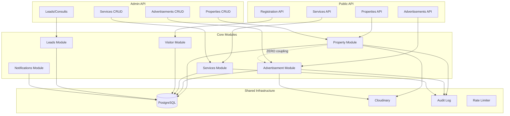

# Architecture

## Overview

MaziVastu is a **modular monolith** built with Next.js App Router. All modules run in a single process suitable for a small VPS.

## Design Principles

1. **Thin route handlers** — API routes validate input, call services, serialize output
2. **Service layer** — All business logic lives in `src/modules/*/service.ts`
3. **Explicit serializers** — Three access levels with dedicated serializers
4. **Database abstraction** — Prisma models are never exposed directly through APIs
5. **Module independence** — Advertisement module has ZERO coupling to Property module

## Access Levels

| Level | Description |
|---|---|
| **PUBLIC** | Anonymous visitor. Browse properties, view public fields |
| **REGISTERED** | Registered visitor (signed JWT cookie). View gated fields, push notifications |
| **ADMIN** | Authenticated admin (Auth.js session). Full CRUD on all entities |

## Module Boundaries



## Why Advertisement is Independent from Property

The BRD v1.0 explicitly requires that advertisements are a completely separate business module:

- **No `isFeatured` flag** on Property — advertisements are not promoted properties
- **No FK from Advertisement to Property** — ads can exist without any property
- **No shared lifecycle** — deleting an ad never affects a property and vice versa
- **Separate media** — `AdvertisementMedia` is independent from `PropertyMedia`
- **Separate placement** — Ads are placed in zones (homepage banner, sidebar, etc.)

This design supports the offline business process where advertisers approach the admin independently of property listings.

## Data Flow: Property Publishing

```
Admin creates property (DRAFT)
    → Admin fills dynamic fields (validated against definitions)
    → Admin uploads media (Cloudinary)
    → Admin publishes property
        → Transaction:
            1. Validate all fields + media
            2. Generate/verify slug
            3. Set status=PUBLISHED, publishedAt
            4. Create audit log
            5. Create notification outbox entry (idempotent)
        → Commit
        → Async: Process notification outbox (non-blocking)
            → Send Web Push to active subscriptions
            → Deactivate dead subscriptions
    → Property appears in public API
    → Push notification sent to subscribers
```

## Data Flow: Registration Gate

```
Anonymous visitor browses → sees public fields only
    → Visitor registers (name + mobile)
        → Signed JWT cookie issued
        → Lead created
    → Subsequent requests include cookie
    → Backend detects visitor session
    → Serializer includes gated fields
    → Visitor sees full property details
```

## Dynamic Fields Architecture

Property custom fields are admin-configurable without code changes:

1. **`PropertyFieldDefinition`** — Schema in database (key, type, options, validation rules)
2. **`Property.metadata`** — Values stored as JSONB
3. **Validation engine** — Loads definitions, validates against them at create/update
4. **Access filter** — Strips gated fields based on visitor session
