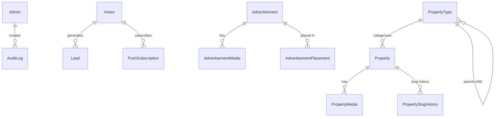

# Database Schema

## Overview

17 models across PostgreSQL, managed by Prisma ORM.

## Entity Relationship Diagram

> **Note**: Advertisement has NO relationship to Property — intentional per BRD.

## Models

### Admin
| Field | Type | Notes |
|---|---|---|
| id | CUID | Primary key |
| email | String | Unique |
| name | String | |
| password | String | bcrypt hashed |
| isActive | Boolean | Default true |
| lastLoginAt | DateTime? | |

### Property
| Field | Type | Notes |
|---|---|---|
| id | CUID | Primary key |
| slug | String | Unique, SEO URL |
| title | String | |
| description | Text? | |
| propertyTypeId | FK | → PropertyType |
| status | Enum | DRAFT/PUBLISHED/ARCHIVED/SOLD/RENTED/INACTIVE |
| approximateLocation | String? | Public |
| gatedLocation | String? | Registered only |
| size | Float? | Gated by default |
| sizeUnit | Enum? | SQFT/SQMT/ACRE/HECTARE/GUNTHA |
| price | Float? | |
| priceType | Enum? | FIXED/NEGOTIABLE/ON_REQUEST/PER_SQFT/PER_MONTH |
| metadata | JSONB | Dynamic field values |
| seoTitle | String? | |
| seoDescription | Text? | |
| publishedAt | DateTime? | |
| deletedAt | DateTime? | Soft delete |

### PropertyFieldDefinition
| Field | Type | Notes |
|---|---|---|
| key | String | Unique machine key |
| label | String | Display name |
| dataType | Enum | TEXT/NUMBER/BOOLEAN/SELECT/MULTI_SELECT/DATE |
| options | JSONB | For SELECT/MULTI_SELECT |
| validationRules | JSONB | { min, max, minLength, maxLength, pattern } |
| isRequired | Boolean | |
| isPublic | Boolean | Visible to anonymous |
| isGated | Boolean | Visible to registered only |
| isFilterable | Boolean | |

### Advertisement
| Field | Type | Notes |
|---|---|---|
| id | CUID | Primary key |
| title | String | |
| slug | String | Unique |
| status | Enum | DRAFT/ACTIVE/INACTIVE/EXPIRED |
| startDate | DateTime? | |
| endDate | DateTime? | |
| **NO propertyId** | | **Intentional — independent module** |

### AdvertisementPlacement
| Field | Type | Notes |
|---|---|---|
| advertisementId | FK | → Advertisement |
| placementZone | Enum | HOMEPAGE_BANNER/CATEGORY_PAGE_SLOT/SIDEBAR/FOOTER_STRIP |
| pageContext | String? | Optional page targeting |
| categoryContext | String? | Optional category targeting |

## Indexes

- `properties`: status, propertyTypeId, publishedAt, slug, deletedAt, composite(status+deletedAt+publishedAt)
- `advertisements`: status, startDate, endDate, slug, deletedAt, composite(status+deletedAt+startDate+endDate)
- `advertisement_placements`: placementZone, advertisementId
- `push_subscriptions`: endpoint (unique), visitorId, isActive
- `audit_logs`: adminId, entityType+entityId, action, createdAt

## JSONB Strategy

- `Property.metadata` — Dynamic field values (validated against `PropertyFieldDefinition`)
- `Lead.metadata` — Contextual info (consultation details, service info)
- `PropertyFieldDefinition.options` — SELECT/MULTI_SELECT choices
- `PropertyFieldDefinition.validationRules` — Numeric ranges, patterns
- `AuditLog.metadata` — Change details

JSONB indexes are NOT applied globally — only where actual filtering queries justify them.

## Soft Delete

Implemented via `deletedAt` on: Property, PropertyType, PropertyFieldDefinition, AlliedService, Advertisement.

All public queries include `WHERE deletedAt IS NULL`.
